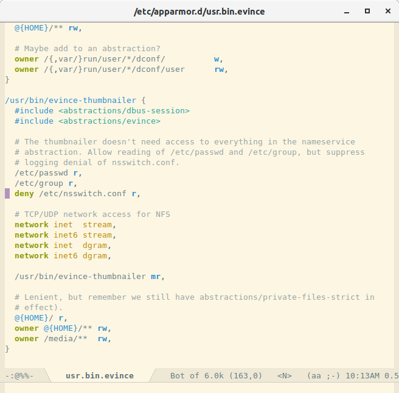

# An Emacs major mode for AppArmor policies

[](http://www.gnu.org/licenses/gpl-3.0.txt)
[](http://melpa.org/#/apparmor-mode)
[](https://travis-ci.org/alexmurray/arxml-mode)

Provides an enhanced editing environment for AppArmor policy files within Emacs, including:

* Syntax highlighting
* Keyword completion via [completion-at-point](https://www.gnu.org/software/emacs/manual/html_node/elisp/Completion-in-Buffers.html)
* [Flymake](https://www.gnu.org/software/emacs/manual/html_node/emacs/Flymake.html) and [Flycheck](http://www.flycheck.org/) integration for basic on-the-fly syntax validation via [apparmor_parser](http://manpages.ubuntu.com/manpages/xenial/man8/apparmor_parser.8.html)



## Installation

### MELPA 

The preferred way to install `apparmor-mode` is via
[MELPA](http://melpa.org) - then you can just <kbd>M-x package-install RET
apparmor-mode RET</kbd>

To enable then simply add the following to your init file:

```emacs-lisp
(require 'apparmor-mode)
```

Then when opening an AppArmor policy file enable via:

```
M-x apparmor-mode
```

To ensure this is done automatically, add the following to the top of the
policy file:

```
# -*- mode:apparmor -*-
```


### Manual

If you would like to install the package manually, download or clone it and
place within Emacs' `load-path`, then you can require it in your init file like
this:

```emacs-lisp
(require 'apparmor-mode)
```

## License

Copyright © 2018 Alex Murray

Distributed under GNU GPL, version 3.
